# Building with Django and HTMX

As I was updating my django boilerplate to "vendor" the two front-end things that I use in every project lately ([AlpineJS](https://alpinejs.dev) and [HTMX](https://htmx.org)) there seemed to be a lot of questions online about getting started with django and HTMX. So it seemed like a good time to write down, ["How I Start"](https://howistart.org)-style, what I do to go from a blank page to get to a point where I can try out an idea.

It's probably worth noting that I also always use [TailwindCSS](https://tailwindcss.com), and that I've intentionally left it out here. This toy application will stop before I bring in Tailwind, and the integration of the tailwind watcher/builder would be a distraction here anyway.

## Prerequisites

You need to have a currently supported python installed. As I write this, that's versions 3.8 - 3.11. I'm using **3.11** to write this, so there's some chance that earlier versions may require minor changes to work. I use [pyenv](https://github.com/pyenv/pyenv) to download and install from python.org, and to allow me to use different versions per-project on my system. But it doesn't matter how you get 3.11, as long as that's your active python version.

In order to follow the exact steps I will write down, you will need [poetry](https://python-poetry.org) on your system. I highly recommend getting that working. If you really want to skip it for now, you can instead create a virtual environment using the [`requirements.txt`](trip_builder/requirements.txt) file at the root of the project. And whenever I say `poetry shell` in a step, you just need to make sure your command prompt has your virtual environment activated, either by running `source` on the activate file on a UNIX-like OS or by running the activate script on Windows.

All of these commands assume you're running on Linux or Mac. Windows will be a little different, and I don't have a current Windows python development machine to test with, so I won't include those in this post.

Other things I'll use as I go:

* git - version control
* [pre-commit](https://pre-commit.com) - installs pre-commit hooks for git to enforce the running of [`black`](https://github.com/psf/black) and [`djhtml`](https://github.com/rtts/djhtml) before every commit.
* [gibo](https://github.com/simonwhitaker/gibo) - download `.gitignore` template to get started

It's perfectly fine to just ignore those for now.

## Starting the project

### Initial dev environment setup

Create a directory for the project, go there, and run `poetry init` to start your `pyproject.toml`:

```
mkdir trip_builder
cd trip_builder
poetry init
```

`poetry init` will ask several questions. I accept the defaults for most of them, but say `no` when it asks about defining dependencies interactively. We'll do that on the command line.

Once poetry has finished, I add the main packages I'll need at runtime:

```
poetry add django django-htmx django-extensions django-widget-tweaks
```

django is the web framework we're using. django-htmx is some middleware and convenience tags for that framework that help integrate it a little more smoothly with HTMX. django-extensions are a set of convenience utilities that I **always** use. And [`django-widget-tweaks`](https://github.com/jazzband/django-widget-tweaks) make it easier to add attributes to elements from django's forms, which is very convenient if you're using HTMX with form elements.

then I add some development tools that keep me sane as I go:

```
poetry add -D pre-commit black djhtml
```

`pre-commit` runs `black` and `djhtml` before every commit, to keep me from putting incorrectly formatted files into git. I find that using these from the very beginning keeps my history much cleaner.

I copy this `.pre-commit-config.yaml` to the top level of my project tree:

```
repos:
  - repo: https://github.com/psf/black
    rev: 23.7.0
    hooks:
      - id: black
        language_version: python3.11
  - repo: https://github.com/rtts/djhtml
    rev: '3.0.6'
    hooks:
      - id: djhtml
```

and I start a new poetry shell:

```
poetry shell
```

then run

```
git init
git branch -m main
gibo dump JetBrains python >.gitignore
pre-commit install
pre-commit autoupdate
```

`gibo` just creates my initial `.gitignore` file. It's fine to create one by hand that matches your tools.

With that, my development environment is set. I like JetBrains things and use PyCharm when I work with django. If you prefer VS code or Emacs, you may want a different `gibo` command.

### Django initialization

Once that's all ready to go, I use `django admin` to start my project. I always call my project `config` and give my app a more meaningful name, but any convention that works for you is obviously fine. Don't forget the **`.`** at the end of the command:

```
django-admin startproject config .
```

That gives me the following files at my project root:

```
.pre-commit-config.yaml	config			manage.py		poetry.lock		pyproject.toml
```

After that, I start two apps. `accounts` is just for holding my custom user class. It's always a good idea to use one, even if you don't think it's needed, just because it's so hard to change later. `trip_builder` is that app we'll be working on in this post.

```
python ./manage.py startapp accounts
python ./manage.py startapp trip_builder
```

Before I do anything else, I finish setting up `accounts` by changing

`models.py`
```
from django.contrib.auth.models import AbstractUser


class User(AbstractUser):
    pass

```

and `admin.py`:
```
from django.contrib import admin
from django.contrib.auth.admin import UserAdmin

from .models import User

admin.site.register(User, UserAdmin)
```

With that, I'm ready to edit `config/settings.py`. First I update `INSTALLED_APPS` to have the third party apps I'm using and my two newly created apps:

```
    "django_extensions",
    "django_htmx",
    "widget_tweaks",
    
    "accounts",
    "trip_builder",
```

Then I add the HTMX middleware to the `MIDDLEWARE` list:

```
    "django_htmx.middleware.HtmxMiddleware",
```

I change the `DIRS` item in my `TEMPLATES` settings dict to:
```
        "DIRS": [BASE_DIR / "templates", ],
```
because I like to have a `templates` directory at my project root instead of each app directory, for small projects like this.

Then I add `STATICFILES_DIRS` so that I can create a `static` directory at my project's root. That's where I save copies of Alpine and HTMX so I don't need a CDN to run my application.

```
STATIC_URL = "static/"
STATICFILES_DIRS = [
    BASE_DIR / "static",
]
```

and finally, I set my `AUTH_USER_MODEL` to reflect the custom user class in my `accounts` app:

```
AUTH_USER_MODEL = "accounts.User"
```

At this point, I create my templates and static directories. Inside static, I create locations for alpine and htmx:

```
mkdir templates
mkdir -p static/js/{alpine,htmx}
```

Then I save the CDN versions of Alpine and HTMX there:

```
curl -o static/js/htmx/htmx.min.js https://unpkg.com/htmx.org@1.9.3/dist/htmx.min.js
curl -o static/js/alpine/alpine.min.js https://cdn.jsdelivr.net/npm/alpinejs@3.x.x/dist/cdn.min.js
```

and I set up my base template in `templates/base.html`:

```

<!DOCTYPE html>
<html lang="en">
<head>
    <meta charset="UTF-8">
    <meta http-equiv="X-UA-Compatible" content="IE=edge">
    <meta name="viewport" content="width=device-width, initial-scale=1.0">
    <title>How I Start Blog Post</title>
    <script defer src=""></script>
    <script defer src=""></script>
</head>
<body>

    <h1>Hello, HTMX</h1>
    <div x-data="{
            hello_message: 'Hello, Alpine'
        }">
        <h1 x-text="hello_message"></h1>
    </div>

<script>
    document.body.addEventListener('htmx:configRequest', (event) => {
        event.detail.headers['X-CSRFToken'] = '{{ csrf_token }}'; //insert csrf token when performing AJAX request
    })
</script>
</body>
</html>
```

Finally, I edit my urls.py module in the `config` project to reference a newly created `urls.py` module in the `trip_builder` app:
```
from django.contrib import admin
from django.urls import path, include

urlpatterns = [
    path("admin/", admin.site.urls),
    path("", include("trip_builder.urls"))
]

```

I add a new url to the new `urls.py` module in the `trip_builder` app:

```
from django.urls import path

from . import views

app_name = "trip_builder"

urlpatterns = [
    path("", views.index, name="index"),
]

```

and I add a new view function to render that using the base template:

```
from django.shortcuts import render


def index(request):
    return render(request, "base.html", context={})

```

and it's time to makemigrations, then start the dev server to see if everything is working so far:

```
python manage.py makemigrations
python manage.py runserver
```

If all my static files and templates are set up correctly, I can see "Hello HTMX" and "Hello, Alpine" in my browser when I visit http://localhost:8000

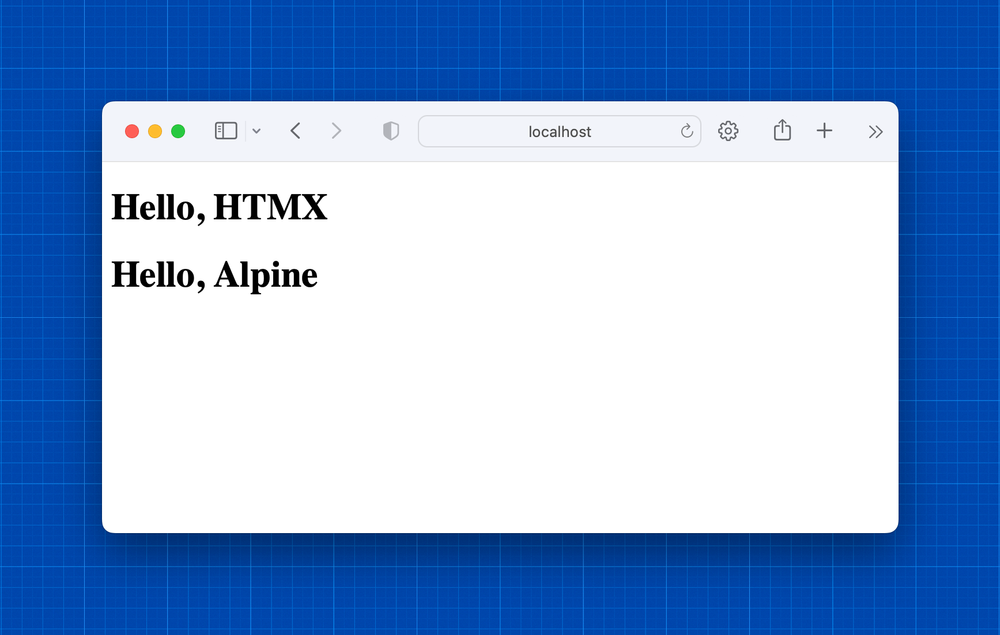

Writing it all out like this, it feels like a lot of boilerplate. But it really only took about 5 minutes to do.

## Models

I find it easiest to define some initial data models and work from there; those usually inform views fairly neatly. For the purposes of seeing how to make two dependent `select` widgets using HTMX, we'll work model an application that lets you plan vacations by selecting from a table of trips. While it'd be both easier and more sensible to structure this differently for a real application, this does allow us to look at the interaction between form widgets and HTMX at a fairly low level.

For the trip model, we'll limit our universe to France, Spain and Germany for now; having 3 will let us see some interesting things. Ordinarily, I think I'd do this as a ForeignKey to a Country model instead of using a choice. Using a choice makes it more ergonomic to seed test data in the admin interface.

`models.py`:
```
class Trip(models.Model):
    class Country(models.TextChoices):
        FRANCE = "FR", "France"
        SPAIN = "ES", "Spain"
        GERMANY = "DE", "Germany"

    country = models.CharField(max_length=3, choices=Country.choices)
    origin = models.CharField(max_length=255)
    destination = models.CharField(max_length=255)
    
    def __str__(self):
        return f"[{self.country}] {self.origin} -> {self.destination}"


```

We'll also add a trivial admin interface to `admin.py`:

```
from django.contrib import admin
from .models import Trip

admin.site.register(Trip, admin.ModelAdmin)

```

With that done, we should migrate the database, create a superuser, and enter some test data.

```
python manage.py makemigrations
python manage.py migrate
python manage.py createsuperuser
python manage.py runserver
```

By visiting http://localhost:8000/admin we can enter test data:

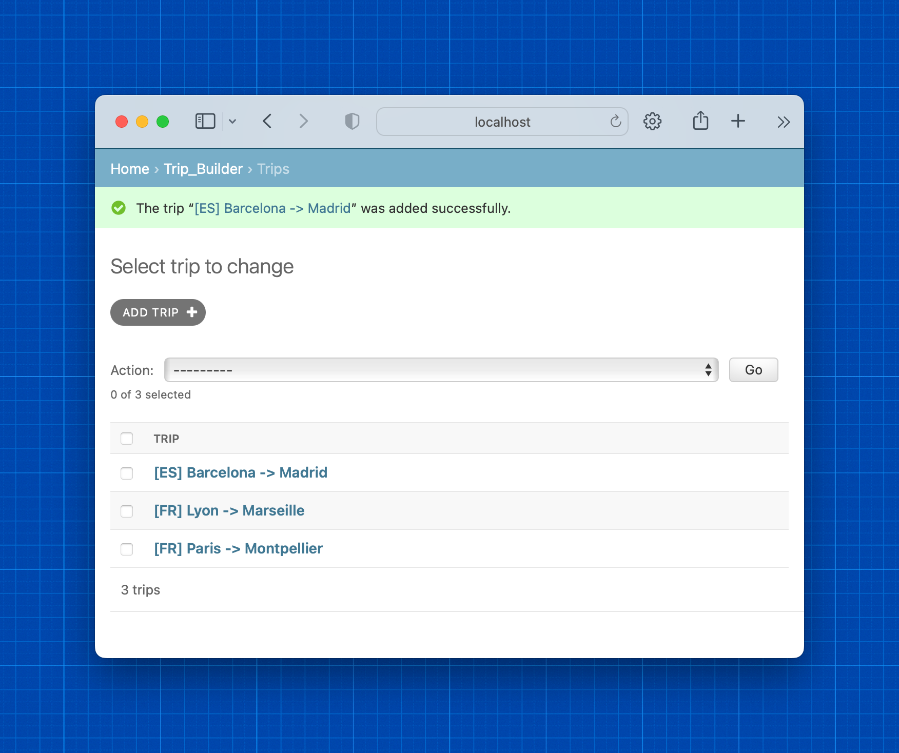

Finally, we need to do something with those trips. Let's make vacations by adding a new model to `trip_builder/models.py`:

```
class Vacation(models.Model):
    user = models.ForeignKey(settings.AUTH_USER_MODEL, on_delete=models.CASCADE)
    name = models.CharField(max_length=255)
    trip = models.ForeignKey("trip_builder.Trip", related_name="vacations", on_delete=models.CASCADE)

    def __str__(self):
        return f"[{self.user}] {self.name}: Trip from {self.trip.origin} to {self.trip.destination}"


```


Since we shouldn't need an administrator to plan a vacation, we'll make user-facing pages to easily build those. But first it'll be necessary to give users a way to log in and out.

Django provides a nice basic login system. For most real projects, we'd probably use `django-allauth`, but for this the built-in system works well. To use it, add the following to `config/urls.py`:

```
path("accounts/", include("django.contrib.auth.urls")),
```

and create a "registration" directory inside "templates". Within that registration directory, create a template called `login.html` and include the following:

```

Log In

<h2>Log In</h2>
<form method="post">
  
  {{ form.as_p }}
  <button type="submit">Log In</button>
</form>

```

and add a `LOGIN_REDIRECT_URL` to `config/settings.py`:

```
LOGIN_REDIRECT_URL = "/"
```

Then create a new template called `index.html` that lists a user's vacations:

```

Vacations

    <h1>Vacations for {{ request.user }}</h1>
    <ul>
    
        <li>{{ trip }}</li>
    
        <li>No vacations planned...</li>
    
    </ul>



```

Go update the view function to use the template and include vacations in the context, as well as to require login:

```
from django.contrib.auth.decorators import login_required
from django.shortcuts import render

from .models import Vacation

@login_required
def index(request):
    vacations = Vacation.objects.filter(user=request.user)
    return render(request, "index.html", context={"trips": vacations})

```

and try things out by migrating, running the server and visiting localhost:8000:

```
python ./manage.py makemigrations
python ./manage.py migrate
python ./manage.py runserver
```

When you visit the front page, you may be asked to login (if not, log out on the admin console...)

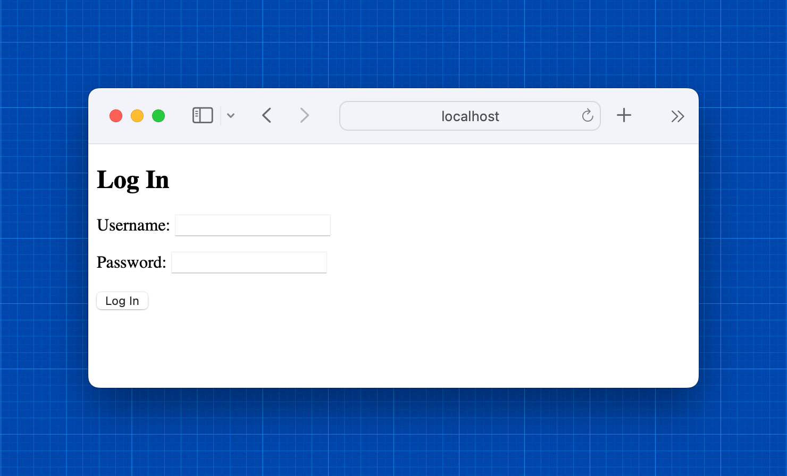

and you should see that your user has no vacation plans yet.

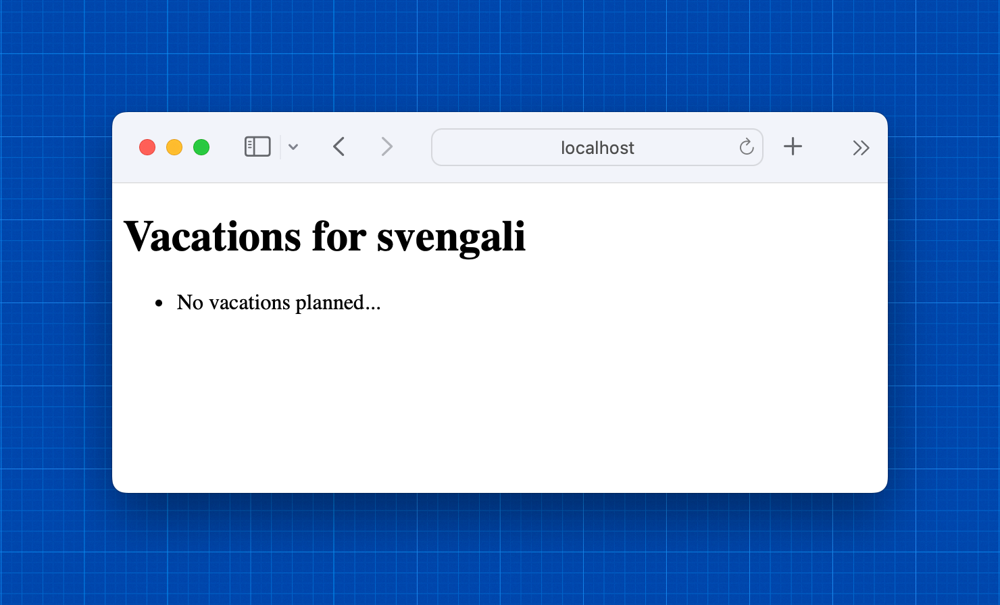

## Vacation Planning UI

Now it's time to make it so a user can build a vacation plan. This is a simple app, so we'll do it from the index page. First, let's make a form.

The common convention is to put django forms in `forms.py`. That's a very good idea for an application with a lot of forms, but for now we've only got one and it's easier to keep the form next to the view until we're done building it. In a real app, I'd move it once it was working.

The form starts out simple:

```
class VacationForm(forms.Form):
    name = forms.CharField(required=True)
    country = forms.ChoiceField(required=True)
    itinerary = forms.ChoiceField(required=True)

```

and it's similarly easy to create a view function to display it:

```
@login_required
def new_vacation(request):
    form = VacationForm()
    return render(request, "new_vacation.html", context={"form":form})
```

and to modify `urls.py` so that requests go to the view function:
```
urlpatterns = [
    path("", views.index, name="index"),
    path("new_vacation", views.new_vacation, name="new_vacation")
]
```

Our first attempt at this template is also simple:
```


    <h2>New Vacation for {{ request.user }}</h2>
    <form action="" method="POST">
        
        {{ form.as_p }}
        <button type="submit">Create Vacation</button>
    </form>

```
but results in a form that doesn't work because the `select` widgets are unpopulated. Where django's `ModelForm` will do this for us, this requires a little more from us. And it's a good way to make use of HTMX.

First, we'll make the template into a fragment that's meant to be rendered within another page in response to an HTMX request:

```
<form>
    {{ form.as_p }}
    <button type="submit" hx-post="">Create Vacation</button>
</form>
```

and modify the index template to allow the user to click a button and fetch that form:

```

Vacations

    <h1>Vacations for {{ request.user }}</h1>
    <div id="vacation_list_wrapper">
        <ul>
            
                <li>{{ trip }}</li>
            
                <li>No vacations planned...</li>
            
        </ul>
    </div>
    <hr>
    <div id="new_vacation_wrapper">
        <button hx-get="" hx-swap="innerHTML" hx-target="#new_vacation_wrapper">Create a Vacation</button>
    </div>


```

A quick test shows that the button appears and the form fetch works, but the form is still not populated.

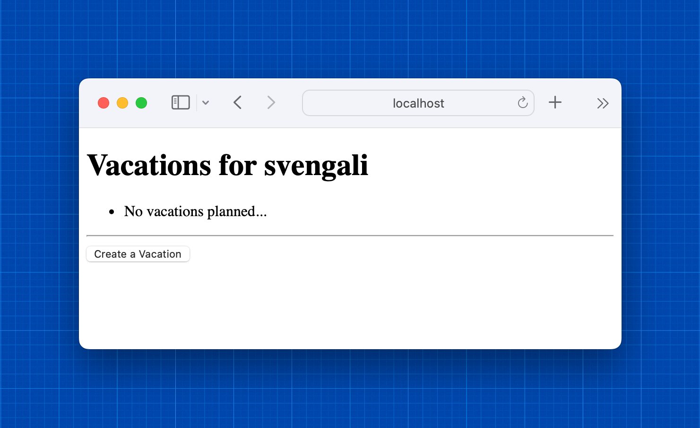
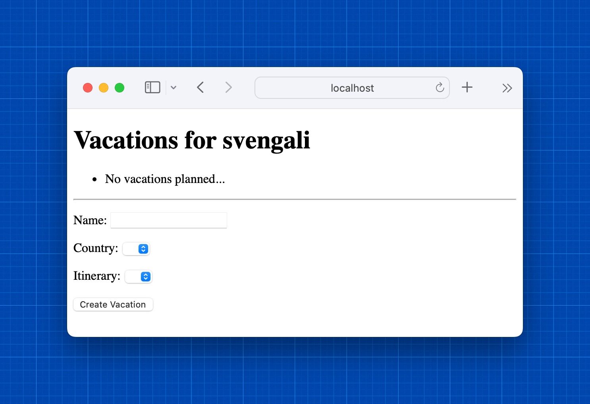

First, we need to modify the django form object so that the "Country" `select` gets a list of the countries available in the table. One way to do this is to override the `__init__` method.

```
    def __init__(self, *args, **kwargs):
        super().__init__(*args, **kwargs)
        self.fields['country'].choices = [("", "Please select a country")] + [c for c in Trip.Country.choices if
                                                                              Trip.objects.filter(
                                                                                  country=c[0]).count() > 0]


```

That's enough to get the Country dropdown populated with only countries that have available trips:

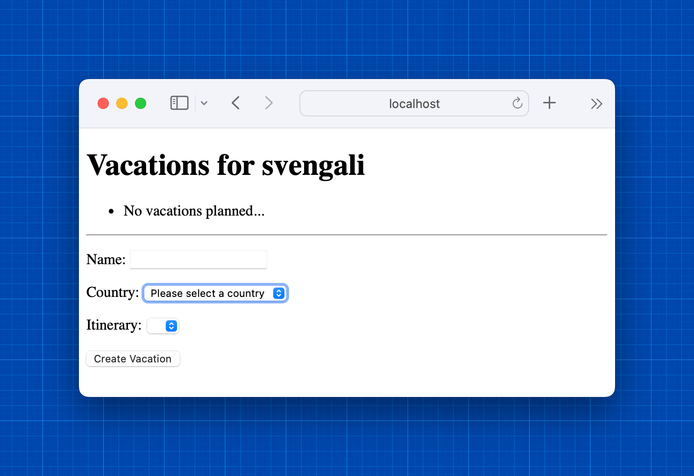

But the itinerary dropdown is still useless. In order to make that work, we'll need to both render each field separately, and make the country dropdown request an updated set of itinerary choices when it changes. First, we separate out the fields, moving the itinerary dropdown into its own template:

```

<form hx-post="">
    <div id="name_wrapper">
        
    </div>
    <div id="country_wrapper">
        
        
    </div>
    
    <button type="submit">Save</button>
</form>
```

```

<div id="itinerary_wrapper">
    
        
    
</div>
```

Then the form needs to know how to populate the itinerary select items when the country is set.

```
class VacationForm(forms.Form):
    name = forms.CharField(required=True)
    country = forms.ChoiceField(required=True)
    itinerary = forms.ChoiceField(required=True)

    def __init__(self, *args, **kwargs):
        super().__init__(*args, **kwargs)
        self.fields['country'].choices = [("", "Please select a country")] + [c for c in Trip.Country.choices if
                                                                              Trip.objects.filter(
                                                                                  country=c[0]).count() > 0]

        self.set_itineraries()

    def set_itineraries(self):
        country = self.data.get("country", "")
        itinerary_options = [("", "Please select an itinerary")]
        available_itineraries = Trip.objects.filter(country=country)
        if available_itineraries:
            itinerary_options += [(i.id, " - ".join([i.origin, i.destination])) for i in available_itineraries]
        self.fields['itinerary'].choices = itinerary_options

```

Once that's done, we need a view function and a URL to make the `select` update work:

```
    path("country_itineraries", views.country_itineraries, name="country_itineraries")
```

```
@login_required
def country_itineraries(request):
    if request.method != "POST":
        return HttpResponseBadRequest()
    form = VacationForm(request.POST)
    return render(request, "itinerary_choice.html", context={"form": form})
```

That's enough to make the `select` widgets work nicely. When we click new, we get only the country selection widget:

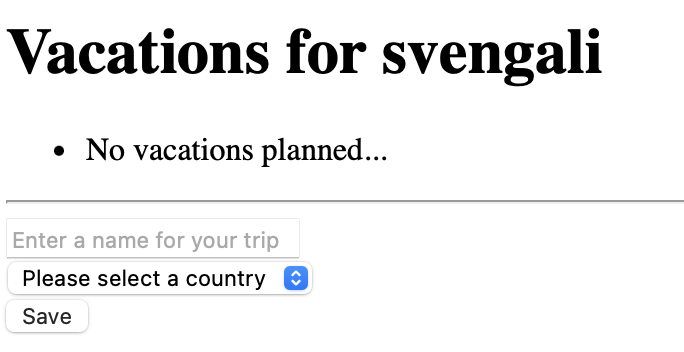

and when we select a country, we get a list of trips in that country:

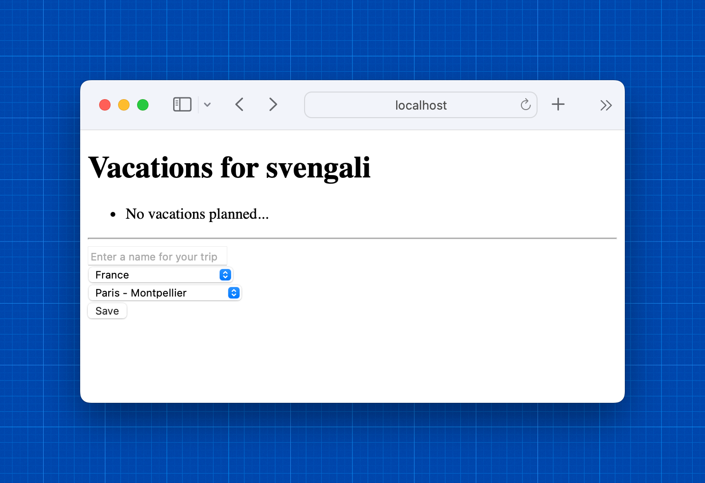

All that's left to do now is to be able to save vacations and update the list. A cancel button might be nice as well.

To make this all easier, first, the vacation list gets its own template:

```
<div id="vacation_list_wrapper" hx-swap-oob="outerHTML">
    <ul>
        
            <li>{{ trip }}</li>
        
            <li>No vacations planned...</li>
        
    </ul>
</div>

```

```

Vacations

    <h1>Vacations for {{ request.user }}</h1>
    
    <hr>
    <div id="new_vacation_wrapper">
        <button hx-get="" hx-swap="innerHTML" hx-target="#new_vacation_wrapper">Create a Vacation</button>
    </div>

```

and a new template to restore the button and list using `hx-swap-oob` gets created:

`index_reset.html`
```

<div id="new_vacation_wrapper" hx-swap-oob="outerHTML">
    <button hx-get="" hx-swap="innerHTML" hx-target="#new_vacation_wrapper">Create a Vacation</button>
</div>
```

Then update our view to handle vacation creation and resetting the form/list:

```
@login_required
def new_vacation(request):
    form = VacationForm()
    vacations = Vacation.objects.all()
    if request.method == "POST":
        form = VacationForm(request.POST)
        if form.is_valid():
            trip = Vacation.objects.create(user=request.user, name=form.cleaned_data["name"], trip_id=form.cleaned_data["itinerary"])
            print(f"Created trip: {trip}")
            return render(request, "index_reset.html", context={"trips": vacations})
        else:
            print(f"Form is invalid: {form.errors}")
    elif "reset" in request.GET:
        return render(request, "index_reset.html", context={"trips": vacations})
    return render(request, "new_vacation.html", context={"form": form})

```

With that, we can create a vacation and see it appear in the list:
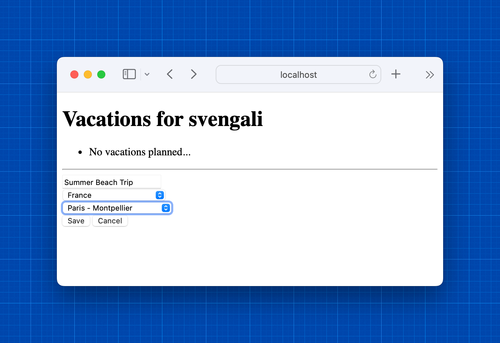
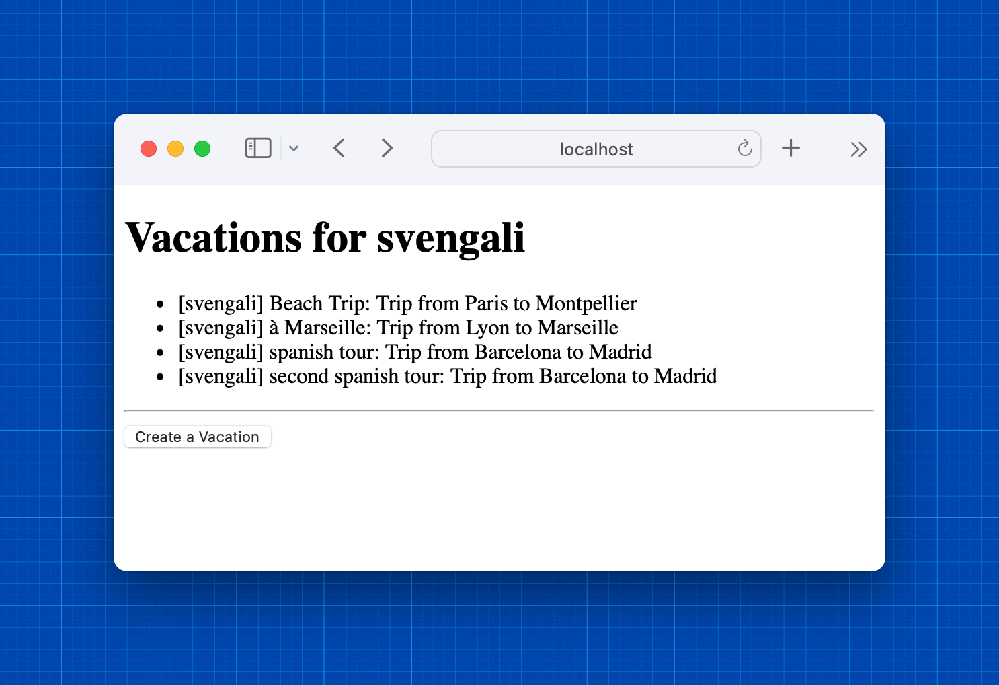

